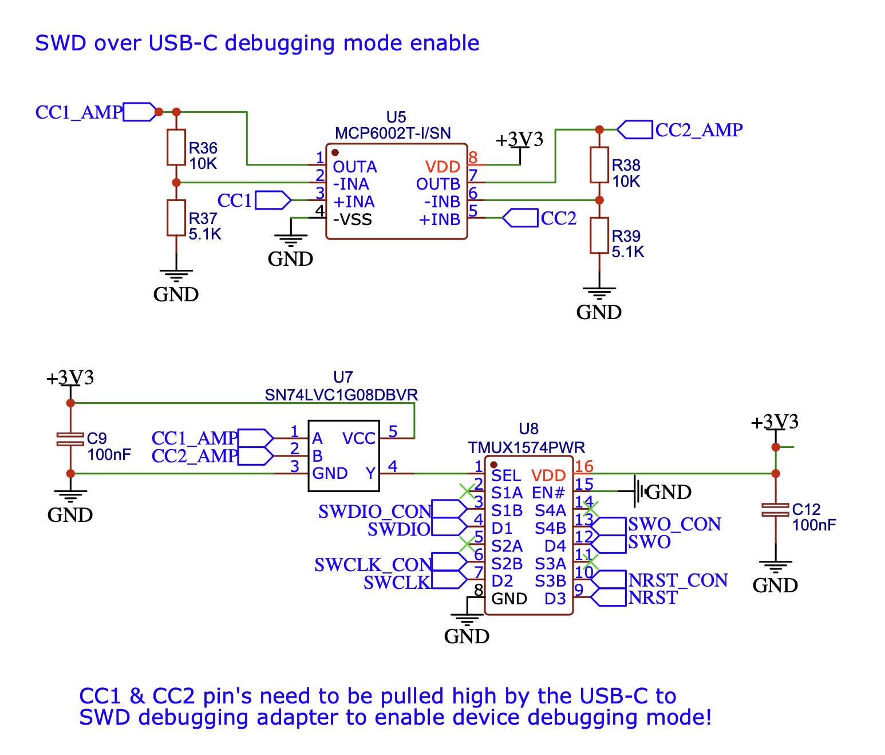

# SWD over USB-C
 It can be usefull to have a single USB-C connector which can be used in device or host mode during normal operation and also gives access to SWD (single wire debugging) over the same USB-C connector.  
 With DAM (Debug Accessory Mode) this is possible.
 https://en.wikipedia.org/wiki/USB-C#Debug_Accessory_Mode  
 In my case I use the device USB-C connector for client software updates with a normal USB-C cable. For debugging and initial programming of the USB bootloader SWD is used.
  
 To let the target defice know that we want to enter debug mode, CC1 and CC2 (Configuration Channels) both have to be pulled high. The target device can then enable the SWD lines.  
 Check out the "Debug accessory mode detection" section for detail how the detection on the target device is done.  

 ## USB-C pinout
 The USB-C connecor has 24 pins in total. 10 of them are used for Vbus (power), GND and CC (Configuration Channels) which leaves 14 pins free for manufacturer-specific port configuration in debug mode.  
 Because 5 additional debug pins where enough for me and I did not want to detect the orientation of the plug, I decided to go with a reversable pin configuration and kept the USB 2.0 differential pair connected in the debug mode.
 > A normal USB-C cable can not be used because they don't pass trough both CC1 and CC2.

 
 
 ## Debugger connections
 ### ST-Link V3 mini [STDC14]
 I like the ST-Link V3 mini because they are small, cheap and officially supported by STM32. The only down side in my opinion is that they are built to work with 1.65V to 3.6V MCU's and for that reason don't supply power to your target device like all official ST-links.  
 You need to power your device separately. You need to connect 5V and GND on the debug connector board to a external power supply.
 https://www.st.com/en/development-tools/stlink-v3minie.html  
 or the older https://www.st.com/en/development-tools/stlink-v3mini.html  
 Order from Mouser for € 10,75 https://eu.mouser.com/ProductDetail/STMicroelectronics/STLINK-V3MINIE

 ### ST-Link V2 clones [IDC10]
 Clones usually work fine but differ a bit from the original.  
 They do not detect the device voltage and work with 3.3V only!
 The good thing is they can supply a few mA 3.3V and 5V to power the device during programming.  
 The clones also don't bring out SWO (printf traces) but you can modify it yourself if you need traces.  https://sudonull.com/post/20076-Completion-of-the-Chinese-ST-Link-v2-add-the-SWO-debug-information-output-interface-and-foot-reset  

 They are available for a few dollars from china.  
 https://nl.aliexpress.com/w/wholesale-ST%2525252dlink-V2.html

 > <b>Maybe somone will make a clone ST-Link which combines the official features (SWO traces, MCU voltage detection...) with 5V power supply and directly has a male USB-C on the other side for SWD over USB-C. </b>

 ## USB-C to SWD connector board
 
 Render of the USB-C to SWD connector board

 ## Target device debug accessory mode detection 
 Normal USB-C cables connect only one CC line which determines the orientation of the plug. The host's pull-up resistor defines the maximum current which can be drawn (for example 56k to 5V for 500mA) and the device pulls the CC line down with a 5.1k pull-down to enable host power delivery.
 For DAM (Debug Accessory Mode) we need to pull both CC lines high.  
 The official DAM resistor values are a bit different.  
 For 500mA @5V 10k on CC1 and 22k on CC2 should be used.  
 - CC1: Host 22k pull-up to 5V and device 5.1k pull-down = 0.9V
 - CC2: Host 10k pull-up to 5V and device 5.1k pull-down = 1.7V

 A logic AND gate (SN74LVC1G08) checks if CC1 and CC2 are logic one and switches a 4-channel MUX switch (TMUX1511) which connects the SWD lines to the USB-C connector.  
 Make sure your debug connector pulls the CC pins above the AND gate minimum high-state voltage (2V in my case) or add an OpAmp between the CC pin's of the connector and the AND gate to boost the voltage.

 > This connector board pulls the CC pins to 5V without a pull-up resistor at all. 

 

 The [target device schematics](/Schematic_DAM_detection.pdf) shows an example of the whole device USB circuit.  

 ## Links
 https://en.wikipedia.org/wiki/USB-C#Debug_Accessory_Mode  
 https://www.usb.org/sites/default/files/USB%20Type-C%20Spec%20R2.0%20-%20August%202019.pdf  
 https://threadreaderapp.com/thread/1495860045728395278.html  
